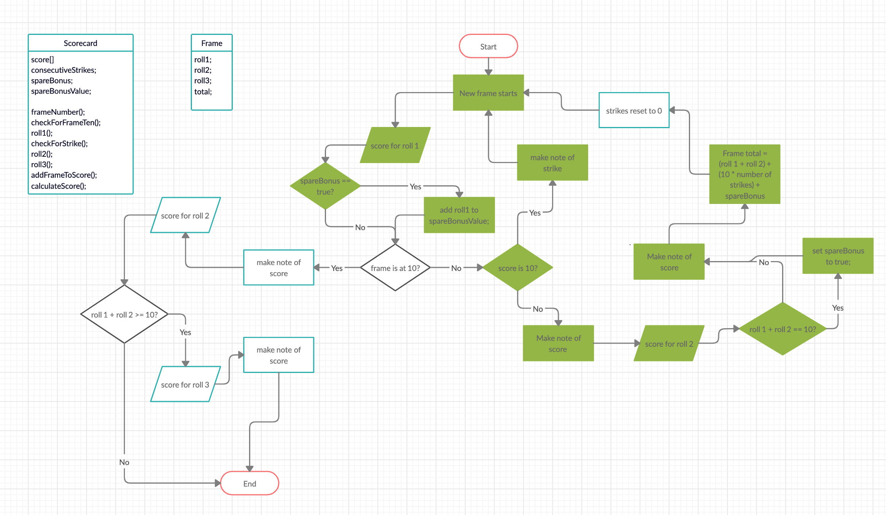

Bowling Challenge
=================


Flow chart: 



Frontend/jquery


## The Task

**THIS IS NOT A BOWLING GAME, IT IS A BOWLING SCORECARD. DO NOT GENERATE RANDOM ROLLS. THE USER INPUTS THE ROLLS.**

Count and sum the scores of a bowling game for one player (in JavaScript).

A bowling game consists of 10 frames in which the player tries to knock down the 10 pins. In every frame the player can roll one or two times. The actual number depends on strikes and spares. The score of a frame is the number of knocked down pins plus bonuses for strikes and spares. After every frame the 10 pins are reset.

## Bowling — how does it work?

### Strikes

The player has a strike if he knocks down all 10 pins with the first roll in a frame. The frame ends immediately (since there are no pins left for a second roll). The bonus for that frame is the number of pins knocked down by the next two rolls. That would be the next frame, unless the player rolls another strike.

### Spares

The player has a spare if the knocks down all 10 pins with the two rolls of a frame. The bonus for that frame is the number of pins knocked down by the next roll (first roll of next frame).

### 10th frame

If the player rolls a strike or spare in the 10th frame they can roll the additional balls for the bonus. But they can never roll more than 3 balls in the 10th frame. The additional rolls only count for the bonus not for the regular frame count.

    10, 10, 10 in the 10th frame gives 30 points (10 points for the regular first strike and 20 points for the bonus).
    1, 9, 10 in the 10th frame gives 20 points (10 points for the regular spare and 10 points for the bonus).

### Gutter Game

A Gutter Game is when the player never hits a pin (20 zero scores).

### Perfect Game

A Perfect Game is when the player rolls 12 strikes (10 regular strikes and 2 strikes for the bonus in the 10th frame). The Perfect Game scores 300 points.

In the image below you can find some score examples.

More about ten pin bowling here: http://en.wikipedia.org/wiki/Ten-pin_bowling

<!--  -->


# User stories
=================
```
As a player,
So i can play bowling game,
I would like to see which frame i play.

As a player,
So i can roll ball,
I would like to see how many pins knoced down.

As a player,
So i have a strike,
I would like to get the bonus points by next two rolls.

As a player,
So i have a spare,
I would like to get the bonus points by next roll.

As a player,
So i have a gutter game,
I unfortunately would like to see zero points.

As a player,
So i can roll ball,
I would like to see every each frame score.

As a player,
So i have perfect game and my friends dont belive, thought i cheated, 
I REALLY would like to see (also to show them) 300 points. 
```

## Extras
-----------------------------------------------
```
As a player,
I can play bowling,
I would like to delete every each frame

As a player,
I can roll a ball,
I would like to see how many total points i could get so far

As a player,
So i come here to play bowling game,
I would like to sign up and log in.   Done

As a player,
I can play bowling,
I would like to see nice and colorful not robotic website

As a player,
I can play bowling,
I would like to see some fancy animations on the website

As a player,
I can play bowling
I would like to play against to computer

As a player,
I can play bowling
I would like to change computer strike/spare luck 

As a player,
I can play bowling
I would like to play against to player

As a player,
I can play bowling
I would like to my advantage point during game

As a player,
I can play bowling
I would like to save my game
```
--------------------------------------------
## Object 
`Bowler`:
| Field | Type |
| --- | -------------------- |
| Player | SERIAL PRIMARY ID |
|        | email VARCHAR(200) |
|        | password  VARCHAR(50) |


`Game` :
| Field | Type |
| ---    |----------------- |
| game   | total_score()    |
|        | bonus_points() |
|        | @bonus_status = false (default)  |
|        | @total_score  |
|        |  @player = new Player |
|        |  @frame = new Frame |

`frame` table:
| Field | Type |
| --- | -------------- |
| frame      | @number |
|            | @total_score |
|            | first_roll |
|            | @second_roll |
|            | @pins|
|            | .strike?|
|            | .gutter_game? |
|            | .perfect_game? |
|            | .spare?|
|            | .open_game|

------------------------------------------------------------------


### Example input:
User selects knocked down pins number from buttons. ‘1’ pin = [ ]

Logic for total score calculation :
Frame class
Frame is default 10
Every frame has 2 rolls unless the player knocks down 10 pins in the first roll.
Frame initialize with button number(score) 
Maybe@score is 2D array
@score = [ [1,9], [8,2], [10,0].. ] 
@score[0] means first frame
@score[0][0] means first frame first roll knocked down pin number.
@total_scores is sum of every each frame
Game class
total score = every each frame sum + bonus points


-------------------------------------------------

TODO: make solid and refactor sign up and sign in
TODO: bcrypted password