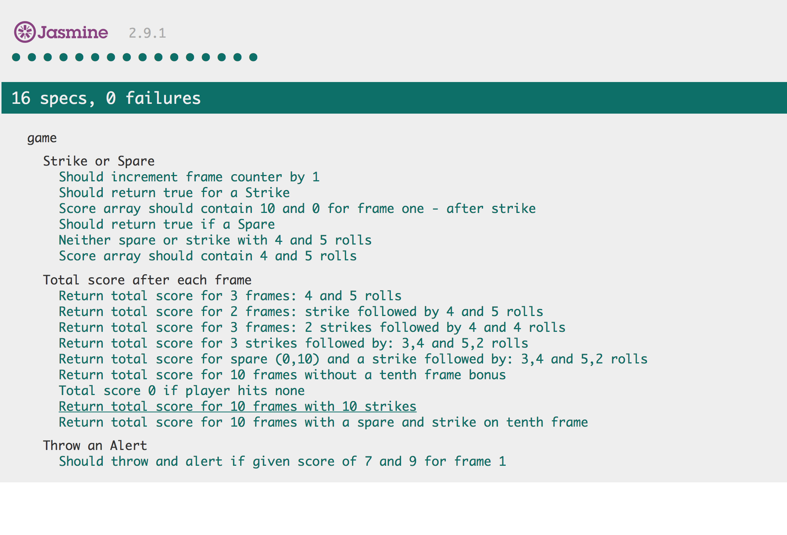

Bowling Scoresheet
=================


## Keeping Score

_Built in JavaScript, tested with Jasmine_

The aim of this app was to count and sum the scores of a bowling game for one player (in JavaScript).

After spending a few days grappling with the logic of the scoring I finally managed to pass all the tests with various scenarios as you can see below.

One important lesson which I have learnt from completing this challenge is to diagram and take small steps. I spent many hours on trying to get the strike and spare logic working and failing to pay attention to the initial scoring. I finally completed the challenge by creating a new git branch and starting all over with better diagrams

Some of the front end design for the table has been inspired by another repo. I have used google fonts for the lobster family font and used [colorhunt.co](http://colorhunt.co/) for the various colour codes.

## How to use this app

* git clone this repository in your terminal like so;

```
$ git clone https://github.com/bpourian/bowling-challenge.git
```
* change into the new created directory
```
$ cd bowling-challenge
```
* finally type in the following command and enjoy the app
```
$ open index.html
```
* To run the tests, in your terminal type
```
$ open SpecRunner.html
```

## Jasmine testing framework


