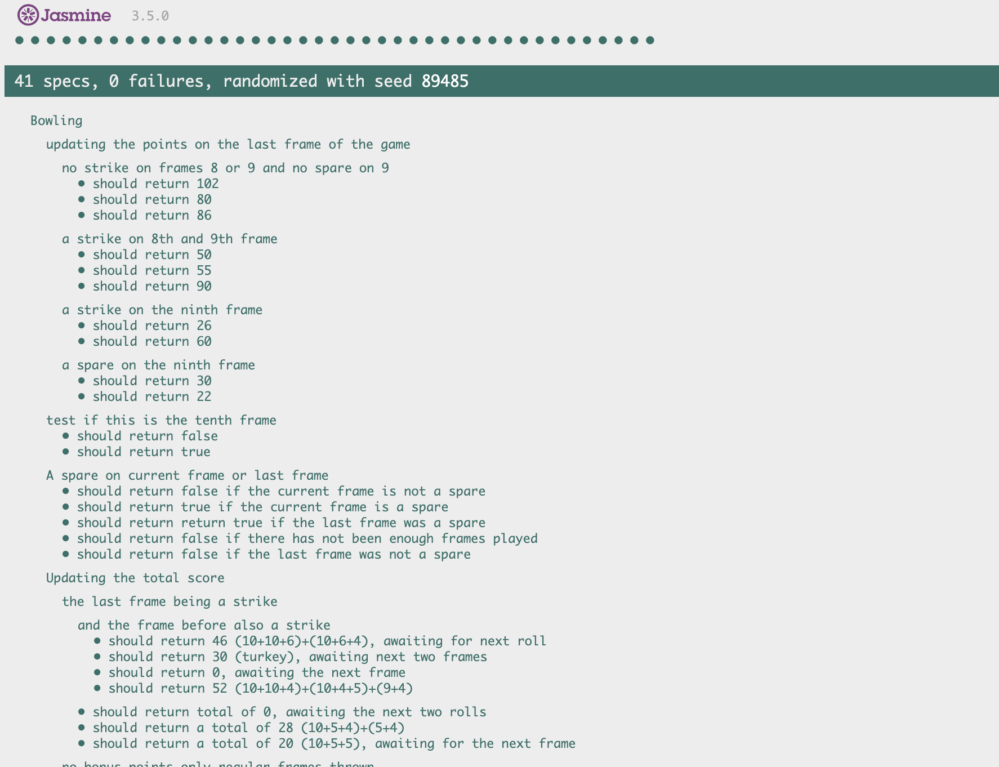

Bowling Challenge
=================

This is an interactive bowling scorecard that users can input their scores as they bowl. The scores are updated on a frame by frame basis. Bonus scores (strikes & spares) are calculated when the correct number of rolls have been made.

## Setting up

### Cloning the repo

Clone this repo by typing `git clone https://github.com/Jamie95187/bowling-challenge.git` inside your terminal.

### Installing Jasmine

Follow the instructions on [jasmine-link](https://github.com/jasmine/jasmine) (note - stop before the step labelled "Add the following to your HTML file").

## Running tests

### Unit testing

The unit tests can be ran by running the `SpecRunner.html`. Type `open SpecRunner.html` inside the terminal which will open your browser of choice and the tests will be displayed in the browser.

### Feature testing

Feature tests can be ran in the Chrome DevTools. This can be accessed by pressing 'command + option + j' in a the google chrome browser. I copied the code from `src/Bowling.js` into the console tab.

**Gutter Game**

A full game of 0 rolls. (Unlucky!)

  

    
  

  

    
  

**Perfect Game**

The perfect game with a score of 300. (Impressive!)

## Technologies Used

**Javascript** - the backend for this project is written in javascript  
**Jasmine** - the testing framework for this project

## Description

A bowling game consists of 10 frames in which the player tries to knock down the 10 pins. In every frame the player can roll one or two times. The actual number depends on strikes and spares. The score of a frame is the number of knocked down pins plus bonuses for strikes and spares. After every frame the 10 pins are reset.

### Optional Extras

In any order you like:

* Create a nice interactive animated interface with jQuery.
* Set up [Travis CI](https://travis-ci.org) to run your tests.
* Add [ESLint](http://eslint.org/) to your codebase and make your code conform.

You might even want to start with ESLint early on in your work — to help you
learn Javascript conventions as you go along.

## Bowling — how does it work?

### Strikes

The player has a strike if he knocks down all 10 pins with the first roll in a frame. The frame ends immediately (since there are no pins left for a second roll). The bonus for that frame is the number of pins knocked down by the next two rolls. That would be the next frame, unless the player rolls another strike.

### Spares

The player has a spare if the knocks down all 10 pins with the two rolls of a frame. The bonus for that frame is the number of pins knocked down by the next roll (first roll of next frame).

### 10th frame

If the player rolls a strike or spare in the 10th frame they can roll the additional balls for the bonus. But they can never roll more than 3 balls in the 10th frame. The additional rolls only count for the bonus not for the regular frame count.

    10, 10, 10 in the 10th frame gives 30 points (10 points for the regular first strike and 20 points for the bonus).
    1, 9, 10 in the 10th frame gives 20 points (10 points for the regular spare and 10 points for the bonus).

### Gutter Game

A Gutter Game is when the player never hits a pin (20 zero scores).

### Perfect Game

A Perfect Game is when the player rolls 12 strikes (10 regular strikes and 2 strikes for the bonus in the 10th frame). The Perfect Game scores 300 points.

In the image below you can find some score examples.

More about ten pin bowling here: http://en.wikipedia.org/wiki/Ten-pin_bowling

## External links used

Inspired by [scorecard template](https://codepen.io/owenjam/pen/reelWN). Used this as a template for building the frontend environment.

## Code Review

In code review we'll be hoping to see:

* All tests passing
* The code is elegant: every class has a clear responsibility, methods are short etc.

Reviewers will potentially be using this [code review rubric](docs/review.md).  Note that referring to this rubric in advance may make the challenge somewhat easier.  You should be the judge of how much challenge you want.

## Things to consider next time

* Planning ahead before starting project.
* Setting up Travis for robust tests.
* Using ESLint for writing conventional javascript.
