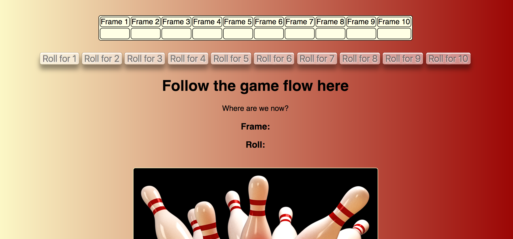

# Bowling Challenge
[](https://travis-ci.com/camjw/bowling-challenge) [](https://coveralls.io/github/camjw/bowling-challenge?branch=master)

This repository is a Javascript implementation of a bowling scorecard. The rules for bowling can be found [here](www.google.com).

The app delivers the following user story:

```
As an avid player of bowling
So that I can know how well I performed
I want to be able to keep track of my score according to the standard rules.
```
## Usage

### Installation

This app runs on Javascript, and uses Node.js to manage dependencies and run the tests. To install Node.js follow the instructions [here](https://nodejs.org/en/). Then install this app by cloning this repository using git and installing the dependencies. Run `npm install` from the root of the repository to do this. Specifically, run the rollowing commands:

```sh
git clone https://github.com/camjw/bowling-challenge.git
npm install
npm run
```


### Running the tests

Unfortunately, a coveralls button has not yet been added to this repository. However, a screenshot of nyc/jasmine report is below:


The only uncovered lines are module exports at the bottom of the file. To run the tests run `npm run test` from the root of the repository. All 51 tests are passing, which cover the backend files. The `interface.js` file, which runs the interactive `jQuery` frontend is untested at the moment.

### Running the app

To run the app just open the `index.html` page, which can be done by running `chrome index.html` from the root if chrome developer tools are installed. These can be found [here](https://developers.google.com/web/tools/chrome-devtools/), and if they are not installed simple navigate to the file in any web browser.

The interface looks nice enough!



Not a bad score!

## Visual features

A `frame` instance will throw an error if the user tries to score more than there are pins remaining. This is done in the roll method:

```javascript
Frame.prototype.roll = function roll(score) {
  if (this.over === true) {
    throw new Error('The frame is already over.');
  } else if (score > 10) {
    throw new Error('The score on one roll cannot be over 10.');
  } else if (this.rolls.length === 1 && this.rolls[0] + score > 10) {
    throw new Error('The overall pins knocked down cannot be over 10');
  }
  this.scoreRoll(score);
};
```

This behaviour is avoided in the user interface. Buttons are automatically disabled in the `disableButtons` method in the `interface` file:

```javascript
disableButtons = function disableButtons() {
  if (scorecard.currentFrame === 9) {
    disableFinalButtons();
  } else {
    const currentFrame = scorecard.frames[scorecard.currentFrame];
    const minimum = (currentFrame.rolls[0] || 0);
    for (let i = 0; i < 11; i += 1) {
      if (i > 10 - minimum) {
        $('#scored' + i).prop('disabled', true);
      } else {
        $('#scored' + i).prop('disabled', false);
      }
    }
  }
};
```

This is seen visually by the disabling of the buttons corresponding to invalid scores:


As is common throughout the repository, there is a separate `disableFinalButtons` to handle the strange behaviour of the final frame.


## Contributing

There are a number of areas where this repository could be improved. These are not limited to:
- Styling: I think the repository looks nice but it could look nicer.
- Contextual messages: the user could be congratulated for a strike and mocked for a gutter ball.
- Getting a coveralls button working.
- Most importantly, more Big Lebowski jokes. At the moment there are exactly zero.

## Acknowledgements

Thanks to Larry, who's [homework](https://www.youtube.com/watch?v=N9Axl-p8BcE) this is not. Link NSFW.

## License

This repository is licensed under the MIT license.
