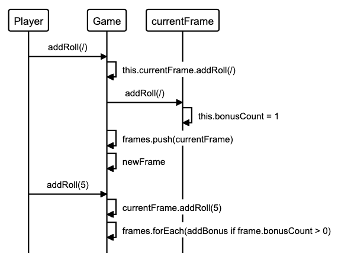

Bowling Score Tracker 🎳
========================

[](https://travis-ci.com/AJ8GH/bowling-challenge) [](https://coveralls.io/github/AJ8GH/bowling-challenge?branch=master) [](https://codeclimate.com/github/AJ8GH/bowling-challenge/maintainability)  [](https://bettercodehub.com/)

Bowling score tracker written in JavaScript

**Use the deployed app here:**

[Bowling Score Tracker](https://bowling-score-tracker.surge.sh/)
--------------------------------------------------------


## Dependencies
- `"coveralls": "^3.1.0"`
- `"eslint": "^7.21.0"`
- `"eslint-config-airbnb-base": "^14.2.1"`
- `"eslint-plugin-import": "^2.22.1"`
- `"jasmine": "^3.6.4"`
- `"karma": "^6.2.0"`
- `"karma-chrome-launcher": "^3.1.0"`
- `"karma-cli": "^2.0.0"`
- `"karma-coverage": "^2.0.3"`
- `"karma-coveralls": "^2.1.0"`
- `"karma-jasmine": "^4.0.1"`
- `"nyc": "^15.1.0"`

## Getting Started

Start by cloning this repository

```shell
git clone git@github.com:AJ8GH/bowling-challenge.git
```

Ensure you have Node installed, by running `node -v`. You can download Node [here](https://nodejs.org/en/download/).

Navigate to the root of the project and install the dependencies.

```shell
cd bowling-score-tracker
npm install
```

### Runnning tests:

To run tests through the command line:
```shell
npm test
```

To run tests in the browser, open `public/js/spec/SpecRunner.html` in the browser and you should see the output of the test suite

### Objectives

The purpose of this project was to build a working score calculator for 10 pin bowling games.

requirements:
- user only has to input each roll, the game logic takes care of calculating the bonuses and checking invalid inputs


- Using jQuery to create a responsive interface ✅
- Using Karma and ChromeHeadless to implement CI with Travis - Build passing ✅
- Using Karma, nyc and Coveralls to automate test coverage reports - 96% < coverage ✅
- Translating specifications into user stories ✅
- Domain modelling and sequence diagrams ✅
- Styling with HTML and CSS ✅
- Linting - applying standard JS style with eslint ✅


### Classes

#### Game class:
- Knows how many frames it has
- Understands how to create and store frames
- Knows when it reaches the final frame
- Knows when it is over
- Knows its score

#### Frame class:
- Knows how many rolls it has
- Knows when it is over
- Knows how many bonuses it needs
- Knows its score
- Can be made final by Game

### Interface:
- Built using js and jQuery
- Responsible for updating the view after each roll input

### Guard Conditions:
- Input of invalid rolls is prevented:
  - non-numbers
  - null rolls
  - rolls > 10 or < 0
  - rolls > the remaining pins of the frame


## Usage


***A perfect Game.***

## Skills applied


***Gutter game. Ouch...***

## Planning

### Sequence Diagrams

#### Spare Bonus



#### Strike Bonus


### User Stories
```
As a bowler,
So that I can track my score while I play,
I want to be able to record a score from 1 roll.

As a bowler,
So that I can track my total score easily throughout a game,
I want my scores to automatically accumlate as I enter them.

As a bowler,
So that my score is accurate and my experience is enjoyable,
I want my bonuses to be added to frames automatically.

As a bowler,
So that I can get extra points,
I want the final frame to allow a bonus roll if I get a spare.

As a bowler,
So that I can bowl a perfect game,
I want the final frame to allow 2 bonus rolls if I get a strike.

As a bowler,
So that my game flows and I can focus on the bowling,
I want the game to automatically register when it is the final frame.
```
