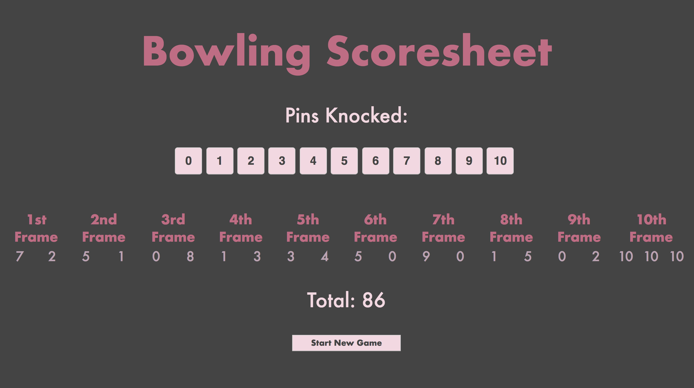

## Bowling Challenge

A Ten-pin bowling scoresheet program where the user inputs the roles for a one player game.

[Rules for Ten-pin bowling](https://en.wikipedia.org/wiki/Ten-pin_bowling#Rules_of_play)

## Technologies used

JavaScript, jQuery, Jasmine, HTML, CSS & Node.js to manage dependencies and run tests.

## My Approach

* Aimed to keep implementation as simple as possible
* One constructor function BowlingGame with two prototypes (roll & score)
* `BowlingGame.prototype.roll` pushes the number of pins knocked in each roll to the property `this.rolls` (an array)
* `BowlingGame.prototype.score` calculates the running total and returns the total score of the game

## Usage

* clone repo to your local machine `git clone https://github.com/MHUS25/bowling-challenge.git`
* To use the app `open index.html`
* To run tests `open SpecRunner.html`

## Screenshots

