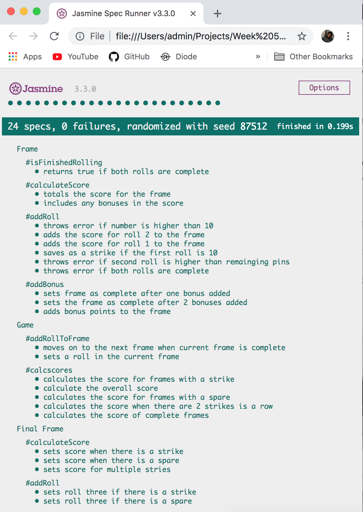

# Bowling Challenge

This program is designed to function as a bowling scorecard which allows users to input their rolls and keeps track of their score throughout a game.

This program was built using JavaScript with a UI built in HTML.

## Getting Started
Follow the instructions below to get started with the bowling scorecard!

### Installation
1. Clone this repo
2. `cd` into the directory
3. `open index.html`
4. Press the buttons to enter your score for each frame

#### Example Usage

## Testing
The program was tested using Jasmine. The files can be found within the `spec` folder

Unit tests were written to test for the functionality of the `Frame.js` and `FinalFrame.js` files. The `Game.js` file holds instances of the other two classes as the game depends on multiple frames. `GameSpec.js` served as a test to check the integration of multiple instances of `Frame` within a game

### Running the Tests
1. `cd` into the directory
2. `npm test`

#### Example

