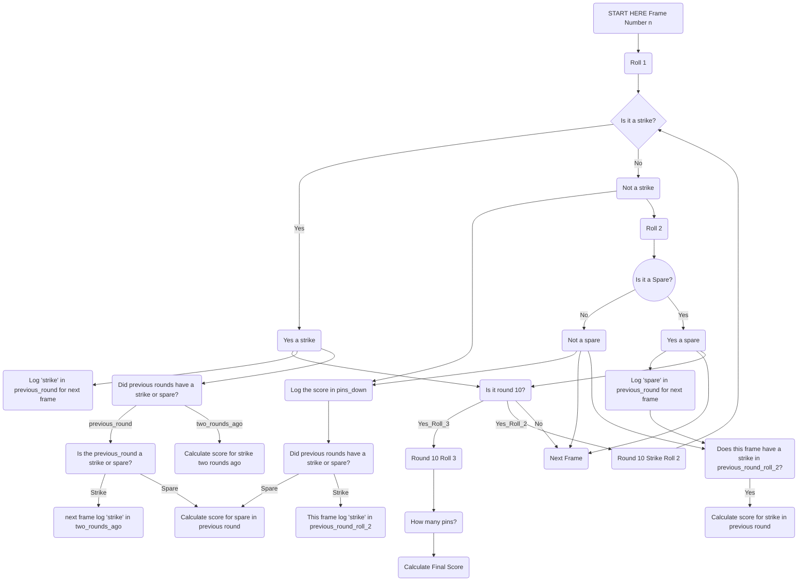

Bowling Challenge in JavaScript
=================

This is the week 6 weekend challenge for Makers Academy Bootcamp.  

For this challenge we have been asked to make a scoring programme for ten pin bowling. 

Planning
=======

