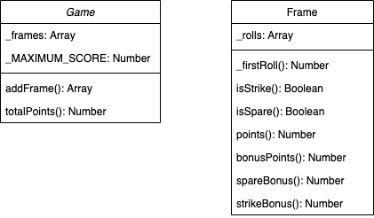

[](https://travis-ci.com/rjkviegas/bowling-challenge)* Did not set up properly

# Bowling Challange

Weekend Challange to build a program that counts and sums the scores of a bowling game for one player.


## Technologies Used

- Program model written in Node JS.
- Testing done using Jasmine 3.6.0 in Goggle Chrome: ```open SpecRunner.html```
- ESLint used to make code conform to widley accepted conventions


## User Stories
```
As a User
So I can keep a record of my rolls
I want the results of them to be stored on a per frame basis

As a User 
So I can focus on getting sweet strikes and spares
I want a program to count and sum my bowling scores
```

## Diagram



### Optional Extras

In any order you like:

- [] Create a nice interactive animated interface with jQuery.
- [] Set up [Travis CI](https://travis-ci.org) to run your tests.
- [x] Add [ESLint](http://eslint.org/) to your codebase and make your code conform.