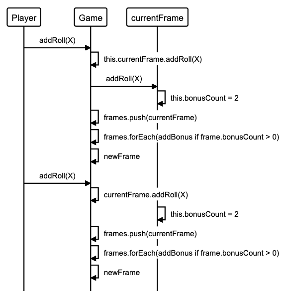

Bowling Challenge 🎳
====================

[](https://travis-ci.com/AJ8GH/bowling-challenge)

Bowling score tracker written in JavaScript

## Getting Started

## Usage

## Approach and Design

### Classes

Frame:
-

Game:
-

## Planning

### Sequence Diagrams

#### Spare Bonus


#### Strike Bonus



### User Stories
```
As a bowler,
So that I can track my score while I play,
I want to be able to record a score from 1 roll.

As a bowler,
So that I can track my total score easily throughout a game,
I want my scores to automatically accumlate as I enter them.

As a bowler,
So that my score is accurate and my experience is enjoyable,
I want my bonuses to be added to frames automatically.

As a bowler,
So that I can get extra points,
I want the final frame to allow a bonus roll if I get a spare.

As a bowler,
So that I can bowl a perfect game,
I want the final frame to allow 2 bonus rolls if I get a strike.

As a bowler,
So that my game flows and I can focus on the bowling,
I want the game to automatically register when it is the final frame.
```
