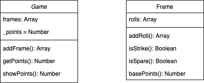

## Bowling Challange

Weekend Challange to build a program that counts and sums the scores of a bowling game for one player.

### Technologies Used

- Program model written in JavaScript
- Testing is done using Jasmine 3.6.0
- ESLint used to make code conform to conventions


### User Stories
```
As a User 
So I can focus on getting sweet strikes and spares
I want a program to count and sum my bowling scores
```

### Diagram

