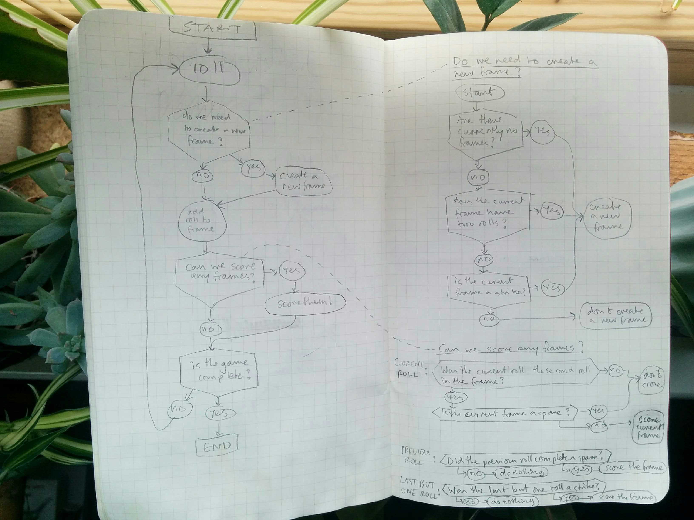
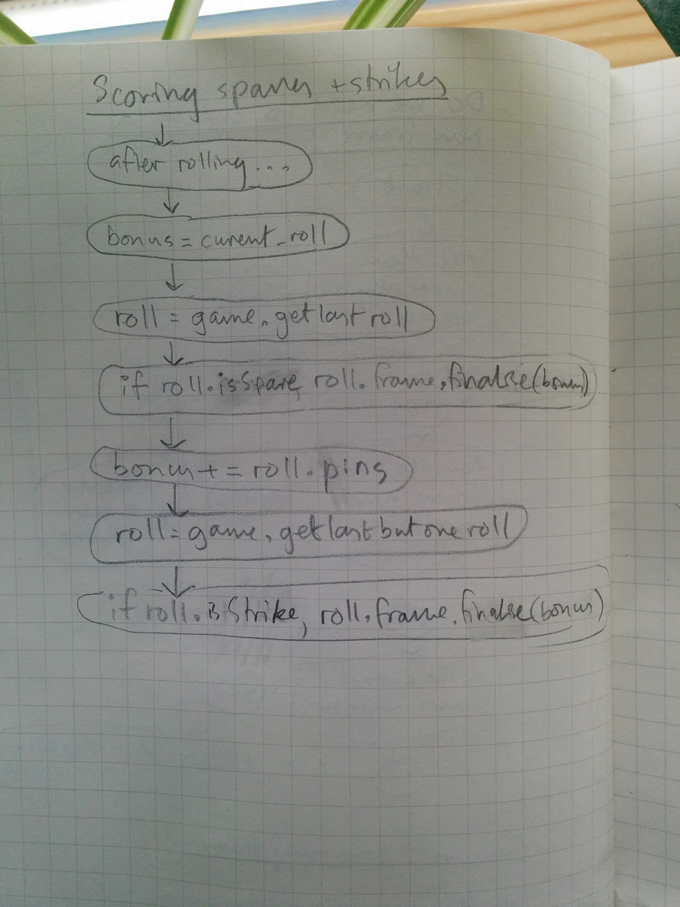

# Bowling challenge attempt 2

*[Instructions](instructions.md)*  
*[Notes](notes.md)*

## Stuff used

- JavaScript
- Jasmine
- npm:
    - `eslint` with [standard style guide](https://standardjs.com/)
    - `eslint-plugin-jasmine`
    - `jasmine` - command line jasmine
    - `jasmine-terminal-reporter` - enhanced jasmine test output in the terminal
    - `nyc` - test coverage. run with `node_modules/.bin/nyc jasmine`
- Travis CI

## Reflection

This started off well but ended up in a mess. My `GameSpec.js` became very complicated when I tried to inject my `Frame` into the `Game`. I think the frame and game objects were too tightly coupled, meaning that I had to simulate a lot of the behaviour of `Frame` in my `Game` tests, so tests became quite complex and hard to read. I think this is an indication that my separation of `Frame` and `Game` was not a good idea! You might say I should have realised this much sooner...

Perhaps the problem arose because I put the logic for scoring frames in `Frame`, which doesn't make sense - the scoring of frames can depend on several consecutive frames, so it shouldn't be a responsibility of an individual frame. More like the responsibility of the `Game`.

Not having learnt my lesson however, I decided to see if I could quickly write a program that worked the way I wanted this attempt to work, without test driving it, just to see if it was possible. See [attempt 3](../attempt-03-no-tdd/).

## Planning

I did more planning this time. It was easier since I had a better idea of the logic starting out, this being my second attempt.

