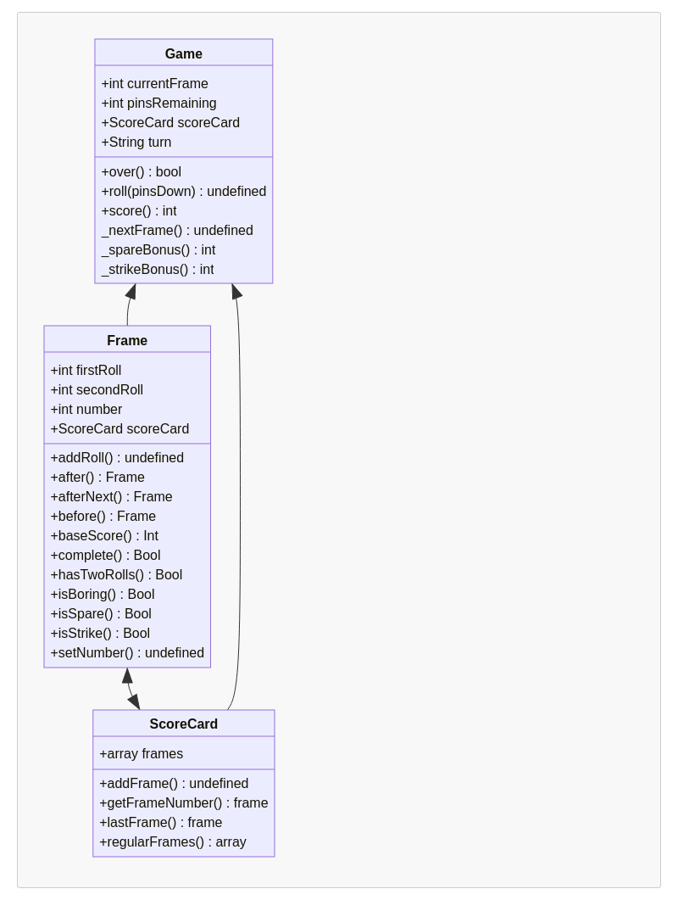

# Bowling Challenge JS Edition

The challenge was to write a javascript bowling scorer following the specifications in [CHALLENGE.md](CHALLENGE.md)

I created classes for `Frame`, `ScoreCard` and `Game`, as described below -

The classes above are pretty exhaustively tested using Jasmine, but play.js, where the user interface lives is not :-(

### TODO

* Test interface (capybara?)
* Make more aesthetic
* Integrate with my P5 bowling sketch
