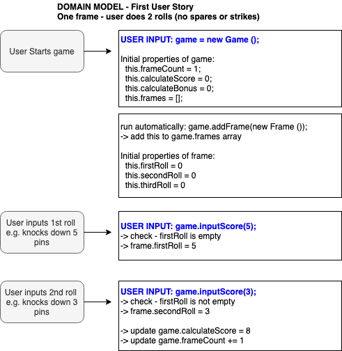
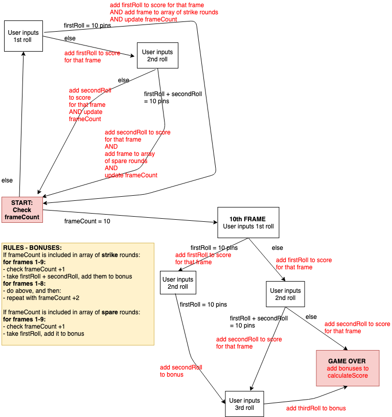

Bowling Challenge - Weekend Challenge for Weeks 5 & 6 - Update as at Sun 1 Sept 2019:
=================
## Purpose of the app:
* The function of the app is to calculate the users score for a bowling game
* User inputs the rolls i.e. how many pins they knock over each time
* There is just one user

## How to use / test this app:
* Clone the github repo by inputting the follwing in your Terminal:
`git clone https://github.com/HannaAikas/bowling-challenge.git`
* Open the relevant folder on your terminal
`cd bowling-challenge`
* Open SpecRunner.html
`open SpecRunner.html`

## Notes - Progress to date:
### DONE:
* Create README and diagram to show the logic of the app
### TO DO - User stories to be implemented:

* One frame - user does 2 rolls (no spares or strikes)
* Two frames - calculate total score for these (no spares or strikes)
* Spares - user plays 2 frames, of which one is a spare
* Strikes - user plays 2 frames, of which one is a strike
* Full game (excl. 10th frame rules) - user plays 10 frames, including some spares, strikes and misses
* Full game incl. 10th frame rules
### TO DO - Functionality:
* Create user interface
### TO DO - Refactoring:
* Is it possible to have "class" Frame be an object that exists within "class" Game? If so, how do you call the constructor method to create a new Frame?

## App logic - Rules of Bowling:

### Game
* = 10 frames
### Frames
* 1 frame = 1 OR 2 rolls (depends on strikes and spares)
* Score of a frame = number of pins knocked down pins PLUS bonuses (depending on strikes & spares)
### Strike
* Strike = knock down all 10 pins on 1st roll
* IF 10th frame, see special rules
* ELSE -> Frame ends, add bonus to score
* Strike bonus = number of pins knocked down by the next 2 rolls (i.e. either next frame OR if the player rolls a 2nd strike)
### Spare
* Spare = If NOT a strike, but knock down all 10 pins within a frame
* IF 10th frame, see special rules
* ELSE -> Frame ends, add bonus to score
* Spare bonus = number of pins knocked down by the next roll (1st roll of next frame)
### 10th Frame
* Special rule for 10th frame = IF a strike OR spare - player CAN do extra rolls, subject to MAX 3 rolls in the 10th frame.
* Points from extra extra rolls only added to the bonus (not included in regular points).
* Examples - 10th frame - 3 rolls:
`10, 10, 10`
`-> 30 points (10 points for the regular first strike and 20 points for the bonus)`
`1, 9, 10`
`->20 points (10 points for the regular spare and 10 points for the bonus)`

ORIGINAL INSTRUCTIONS FROM MAKERS:
=================
Bowling Challenge
=================

* Challenge time: rest of the day and weekend.
* Feel free to use google, your notes, books, etc. but work on your own
* If you refer to the solution of another coach or student, please put a link to that in your README
* If you have a partial solution, **still check in a partial solution**
* You must submit a pull request to this repo with your code by 9am Monday week

## The Task

**THIS IS NOT A BOWLING GAME, IT IS A BOWLING SCORECARD. DO NOT GENERATE RANDOM ROLLS. THE USER INPUTS THE ROLLS.**

Count and sum the scores of a bowling game for one player (in JavaScript).

A bowling game consists of 10 frames in which the player tries to knock down the 10 pins. In every frame the player can roll one or two times. The actual number depends on strikes and spares. The score of a frame is the number of knocked down pins plus bonuses for strikes and spares. After every frame the 10 pins are reset.

As usual please start by

* Forking this repo

* Finally submit a pull request before Monday week at 9am with your solution or partial solution.  However much or little amount of code you wrote please please please submit a pull request before Monday week at 9am.  And since next week is lab week you have a full extra week to work on this.

___STRONG HINT, IGNORE AT YOUR PERIL:___ Bowling is a deceptively complex game. Careful thought and thorough diagramming — both before and throughout — will save you literal hours of your life.

### Optional Extras

In any order you like:

* Create a nice interactive animated interface with jQuery.
* Set up [Travis CI](https://travis-ci.org) to run your tests.
* Add [ESLint](http://eslint.org/) to your codebase and make your code conform.

You might even want to start with ESLint early on in your work — to help you
learn Javascript conventions as you go along.

## Bowling — how does it work?

### Strikes

The player has a strike if he knocks down all 10 pins with the first roll in a frame. The frame ends immediately (since there are no pins left for a second roll). The bonus for that frame is the number of pins knocked down by the next two rolls. That would be the next frame, unless the player rolls another strike.

### Spares

The player has a spare if the knocks down all 10 pins with the two rolls of a frame. The bonus for that frame is the number of pins knocked down by the next roll (first roll of next frame).

### 10th frame

If the player rolls a strike or spare in the 10th frame they can roll the additional balls for the bonus. But they can never roll more than 3 balls in the 10th frame. The additional rolls only count for the bonus not for the regular frame count.

    10, 10, 10 in the 10th frame gives 30 points (10 points for the regular first strike and 20 points for the bonus).
    1, 9, 10 in the 10th frame gives 20 points (10 points for the regular spare and 10 points for the bonus).

### Gutter Game

A Gutter Game is when the player never hits a pin (20 zero scores).

### Perfect Game

A Perfect Game is when the player rolls 12 strikes (10 regular strikes and 2 strikes for the bonus in the 10th frame). The Perfect Game scores 300 points.

In the image below you can find some score examples.

More about ten pin bowling here: http://en.wikipedia.org/wiki/Ten-pin_bowling

## Code Review

In code review we'll be hoping to see:

* All tests passing
* The code is elegant: every class has a clear responsibility, methods are short etc.

Reviewers will potentially be using this [code review rubric](docs/review.md).  Note that referring to this rubric in advance may make the challenge somewhat easier.  You should be the judge of how much challenge you want.
