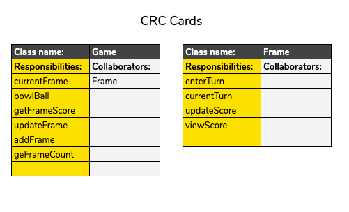

# User Story 3

> As a user, 
When a frame is complete, 
My nex bowl starts a new frame

## Specification

- [X] Game checks turns to determine if frame is complete
- [X] Game adds frame to frames

## Classes

