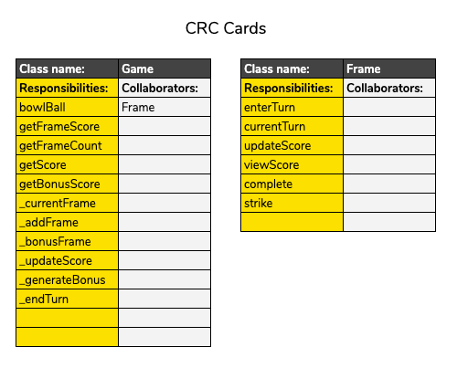

# User Story 5

> As a user, 
If I roll a strike, 
The game create a new frame and calculate a strike bonus

## Specification

- [X] new frame is created
- [X] next frame score is added to bonus score
- [X] games score is frames score and bonus

## Classes

