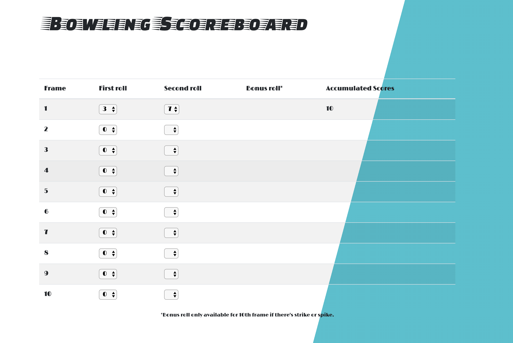

```
____                _ _             
| __ )  _____      _| (_)_ __   __ _ 
|  _ \ / _ \ \ /\ / / | | '_ \ / _` |
| |_) | (_) \ V  V /| | | | | | (_| |
|____/ \___/ \_/\_/ |_|_|_| |_|\__, |
                               |___/  
											by grumpy_chloe
```

(I'd either be an expert or hate it, let's find out)

After (over 1 hour of trying to understand the rules and) researching online how people built it, I got some idea from [BowlingGenius](https://www.bowlinggenius.com/), I decided to make a table with:
    
    -11 rows: 10 rows for each frames and 1 for accumulated scores. 

    -3 columns: frame 1-9 will have 2 columns for each  roll, and 10th frame will have 3 row just in case somebody really knows how to roll and strike or spare. 
 
...and I will make buttons for score input. ~~Yay. Shut it. I am excited.~~ Off to build the scaffold of the page. 

After the table is created, I can visualise where the data goes. I then added the dropdown for scores selection and start formulating how to calculate scores in the model `score_calculator.js`.

So far the web looks like this:


here's the code:

```javascript

$(document).ready(function () {

for (let i = 0; i < 11; i++) {

// Frame 1 
  $(`#frame${i}Roll1`).on('change', function () {
    var roll1 = parseInt(this.value);
  $("#frame1Row2").empty();

    for (let r = 0; r < 11 - roll1; r++) {
      $(`#frame${i}Roll2`).append(`<option value="${r}">${r}<option>`)
    }

    $(`#frame${i}Roll2`).on('change', function () {
      var roll2 = parseInt(this.value);

        $(`#frame${i}Score`).text(roll1 + roll2);
    })
   })
  }
})
```
I first created the second loop (`let r ...`)to populat the dropdown options in column `Second Roll`. Then defined how to calculate scores ` $('#frame${i}Score').text(roll1 + roll2);` . Viola! the first row of the table is completed. Then I created the for loop `let i ...` to populate the rest of the rows (i.e. frame 2 to 10) to fill the whole table. 

**So far there's 3 problems left to solve :**
1. Strike Bonus is not defined.
2. Spare Bonus is not defined.
3. The `Accumulated scores` column is not accumulating... hence we cant get the final score, but this one shouldn't to be hard if the above two solved.

```
 ___________ 
< Exciting! >
 ----------- 
        \   ^__^
         \  (xx)\_______
            (__)\       )\/\
             U  ||----w |
                ||     ||
```


